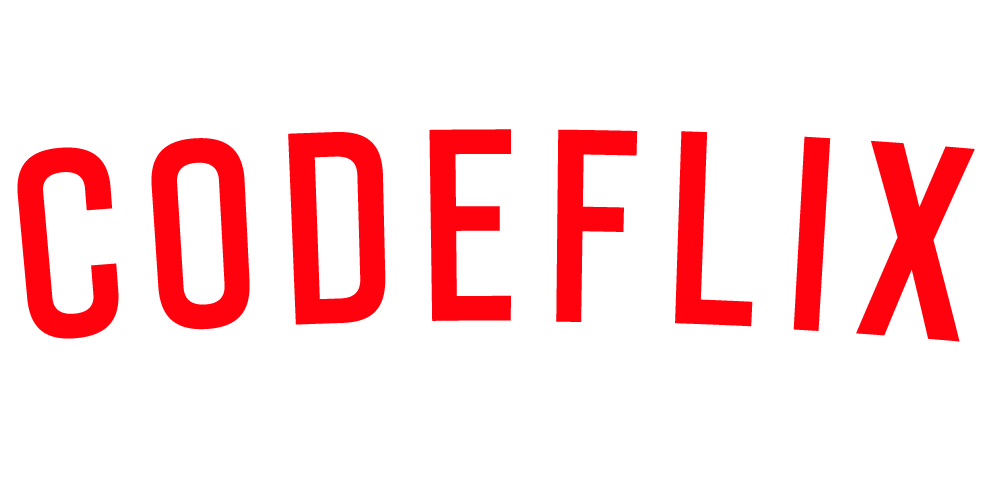
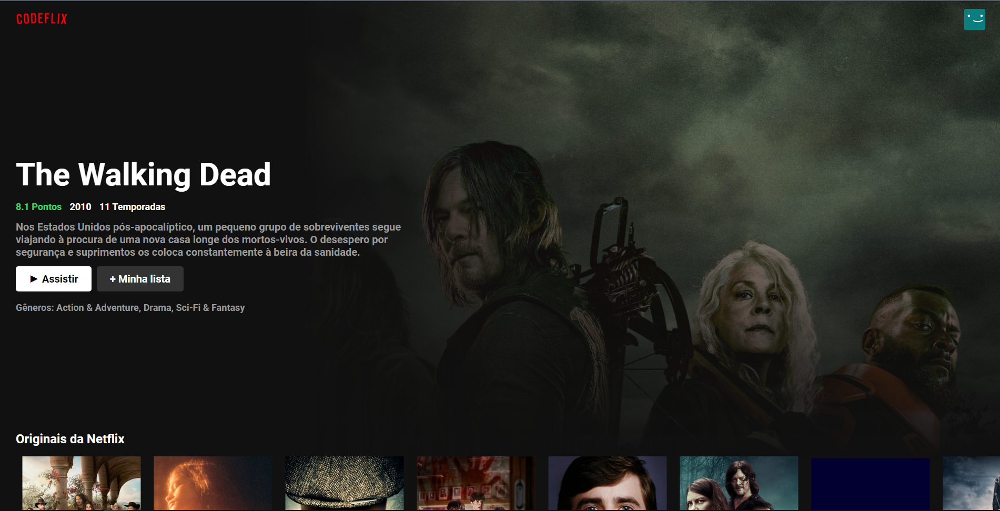
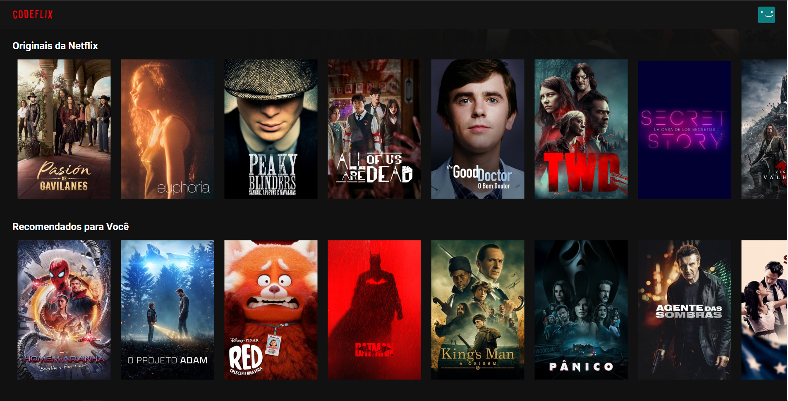

# Codeflix

**Aplicação totalmente didática, onde desenvolvemos um clone da Netflix utilizando ReactJS** 

Este projeto foi estudado no curso de Desenvolvimento Web na escola Code Universe.

### Rodando localmente

Clone o projeto

```bash
  git clone https://github.com/andersjay/Codeflix.git
```

Entre no diretório do projeto

```bash
  cd my-project
```

Instale as dependências

```bash
  npm install
```

Inicie o servidor

```bash
  npm run start
```


### Stack utilizada

**Front-end:** React, SASS, HTML, JS


### Aprendizado

Nessa aplicação aplicamos vários conceitos do React, desde hooks até consumo de API externa.

Aplicamos o pré-processador SASS na prática.

Utilizamos a API do TMDB (The Movie Database) - https://developers.themoviedb.org/3

## Screenshots




